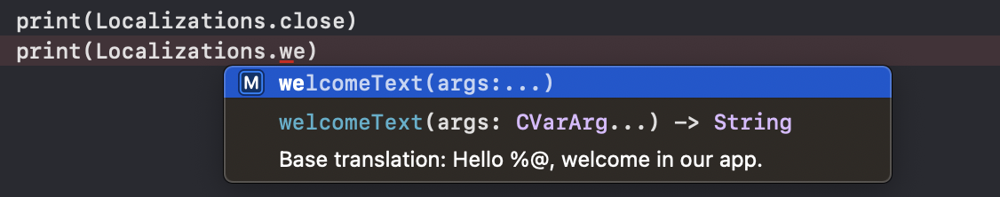

[](https://developer.apple.com/swift/)

## Typed Translations

this swift package will make it easy to enable typed access to your literals specified in the `Localizable.strings` file.

### Quick run

```
swift run -c release TypedTranslations Localizable.strings
```

### What to expect?

You can expect easy typed access to your translations like it should be. No hassle with typos or missing translations anymore. Enjoy!



#### Input

```
"welcomeText" = "Hello %@, welcome in our app.";
"close" = "Close";
```

#### Output

``` swift
//
//  Localizations.swift
//
//  Generated code that contains the available keys from en.lproj/Localizable.strings
//  Copyright © 2020. All rights reserved.
//

import Foundation

extension String {
    func localized(bundle: Bundle = .main, tableName: String = "Localizable") -> String {
        NSLocalizedString(self, tableName: tableName, bundle: bundle, value: self, comment: "")
    }

    func localizedWithFormat(bundle: Bundle = .main, tableName: String = "Localizable", args: CVarArg...) -> String {
        String.localizedStringWithFormat(self.localized(bundle: bundle, tableName: tableName), args)
    }
}

struct Localizations {

    private init() {}

    /// Base translation: Hello %@, welcome in our app.
    static func welcomeText(args: CVarArg...) -> String {
        "welcomeText".localizedWithFormat(args: args)
    }
    /// Base translation: Close
    static let close = "close".localized()
}
```

Just include this generated file in your XCode project and rerun the script whenever the `.strings` file is updated.

### Where is my XCode project?
- Run `open Package.swift` to open this swift package.

### Tests

For running tests, just run `swift test`. 
